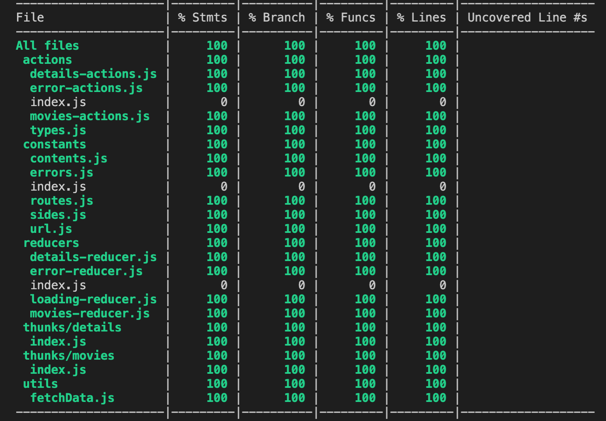

# RAKUTEN-TEST
React-redux project that consumes the Rakuten API. The application shows the movies separated by category and shows a detail page if we click on a movie.

## Table of contents
1. [Technologies](#1.technologies)
2. [Setup](#2.setup)
3. [Structure](#3.structure)
    * 3.1. [Pages](#3.1.pages)
        * 3.1.1. [Not-Found](#3.1.1.not-found)
    * 3.2. [Containers](#3.2.containers)
    * 3.3. [Components](#3.3.components)
4. [Redux](#4.redux)
    * 4.1. [States](#4.1.states)
        * 4.1.1. [Error State](#4.1.1.error-state)
        * 4.1.2. [Loading State](#4.1.2.loading-state)
        * 4.1.3. [Movies and Details State](#4.1.3.movies-and-details-state)
    * 4.2.[Selectors](#4.2.selectors)
        * 4.2.1. [Error Selector](#4.2.1.error-selector)
        * 4.2.2. [Movie Selector](#4.2.2.movie-selector)
        * 4.2.3. [Details Selector](#4.2.3.details-selector)
    * 4.3. [Middleware](#4.3.middleware)
5. [Code Coverage](#5.code-coverage)
6. [Conclusion](#6.conclusion)

## 1.Technologies
* Javascript
* React v.17.0.1
* Redux v.4.0.5
* Jest v26.0.6
* Webpack v.5.11.1

## 2.Setup
To run this project, you have to:

```bash
# Clone this repository
$ git clone https://github.com/ferrancl/rakuten-test

# Go into the repository
$ cd rakuten-test

# Install dependencies
$ npm install

# Run the app
$ npm start
```

## 3.Structure

The application is split in views, containers and components.
This structure has been made for making the application cleaner and clearer.

### 3.1.Pages
In this project, there are three different pages: Home, Detail and Not-found. Inside them, the containers and components are rendered.

#### 3.1.1.Not-Found
I want to point out when this page is being rendered. There are two situations in which the application will guide us to the ./not-found path:
* If we put directly this path in the url bar or
* If we put a invalid path

It is important to notice that an invalid path can be produced for two different situations. One possibility is that we put a path that does not appear in our routes, so, we redirect the user to this view.\
The other possibility is that we pass through the path ./movies/:movie one movie that is not in the API. Then, the application catches the error and redirect to the Not-Found page.

### 3.2.Containers
Containers encapsulate the logic needed, keep track of state and are responsible for providing it to their child components. Known as smart components.

### 3.3.Components
Their only responsability is to present something to the DOM. Known as dumb components.

## 4.Redux
Redux is the responsible for managing the global state of the application. Actions, reducers, thunks, selectors and the store are separated in their particular folder.\
### 4.1.States
#### 4.1.1.Error State
There is a global error state for the whole app. ErrorContainer only receives the error if the error != 404. This is because if the error is 404, we will redirect
to the Not-Found page and not show the ErrorMessage. The error is cleaned automatically after 4 seconds.

#### 4.1.2.Loading State
Like the error state, there is a global loading state for the entire application.

#### 4.1.3.Movies and Details State
The data fetched is put into them and is processed with selectors.\

### 4.2.Selectors
#### 4.2.1. Error Selector
This selector is looking to the state.error and passes the error to the ErrorMessage component to show it.

#### 4.2.2. Movies Selector
This selector looks to state.movies. Thanks to this selector the application only fetches the movie data once.

#### 4.2.3. Details Selector
State.details save the data of the last details of the movie visited. This way, if we come back to the same detail page, the app does not need to fetch the data.I have decided to add only the last and not the entire data of the details visited to avoid iterating every time we render the Detail page.

### 4.3.Middlware
The middlware used for managing the asynchronous calls is redux-thunk.

## 5.Code Coverage




## 6.Conclusion
The main objective of the project has been replicate this part of the Rakuten webpage, using good practices, clean and reusable code, with a good structure 
and trying to facilitate the comprehension for a person who sees the code for first time.
Possible improvements are adding more information in the detail page, like the official webpage of Rakuten, or writing more tests.
